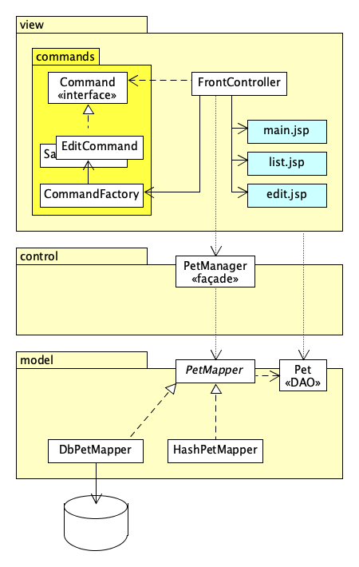
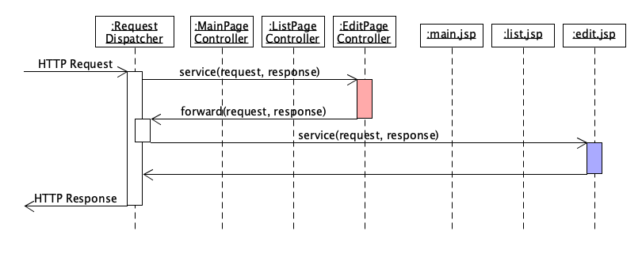

# Module 3 Architecture example project

The project implements a very simple web-application.
The following state machine models the site map:

  
*Figure 1 - Site map state machine*

## Layers

The project uses a layered architecture.
The layering is not strict,
because the `view` layer references other layers than the layer immediately below, namely the `control` layer.
It also references the `model` layer.

  
*Figure 2 - Layers*

### The `view` layer

Also known as:
* presentation layer

### The `control` layer

Also known as:
* function layer
* business logic layer

### The `model` layer

Also known as:
* data layer
* data access layer
* entity layer

## Patterns

Here are some of the patterns used in this mini project.

### The *Singleton* pattern

The `model.HashPetMapper` is a singleton.
You can use a singleton when you want to be sure
that only one instance exists at any time.

```java
class HashPetMapper extends PetMapper {
  private static HashPetMapper instance = null;
  ...

  private HashPetMapper() { ... }

  public synchronized static HashPetMapper getInstance() {
    if (instance == null) instance = new HashPetMapper();
    return instance;
    }

  }
```
Note that
* the constructor is `private`, so no one can make an instance directly.
* the `instance` is `static`, common to all instances (if there could be more than one)
* the `getInstance()` method is `synchronized`

### The *Façade* pattern

Use a Façade object as the public entry to a module,
where you want the implementing classes to be private
to encapsulate the implementation.

The `model.PetMapper` class is a Façade.

```java
package dk.cphbusiness.pets.model;

public abstract class PetMapper { ... }

class HashPetMapper extends PetMapper { ... }
class DbPetMapper extends PetMapper { ... }
```

Note that
* the `PetMapper` class is `public`
* the `HashPetMapper` class is package private as would a `DbPetMapper` be.

A class is *package private* when there is no visibility modifier.
Meaning that only classes from the same package can see them.

### The *Command* pattern

Use a Command pattern when want to be able to choose between
different methods at runtime,
and you want to encapsulate the logic of choosing the method
and the number of methods to choose from.

The idea is to embed the methods in objects all implementin a common command interface.
All methods shall of course have the same signature and return type.

```Java
public interface Command {
  String execute(
      HttpServletRequest request,
      PetManager manager
      ) throws CommandException;
  }

class ListCommand implements Command {
  private String target;

  ListCommand(String target) {
    this.target = target;
    }

  @Override
  public String execute(
      HttpServletRequest request,
      PetManager manager
      ) {
    Collection<Pet> pets = manager.list();
    request.setAttribute("pets", pets);
    return target;
    }

  }
```

Note that:
* the `ListCommand` class is package private
* the `execute` method can, but does not have to `throw CommandException`

### The *Factory* pattern

Instantiation of classes (making `new` objects) is one of the things
that cannot be done in a polymorhic way. You can treat triangles, cubes, circles,
and rectangles as shapes in an object-oriented language.
You don't need to know the type to get the area of shape as long as it implements the `getArea()`
method. In the same way as we don't need which `Command` we are dealing with to
`execute` it.

But we have to know which type it is to create one!

Collecting all instantiations one class helps a lot,
and we get the benefit that we can reuse object when appropriate.
In that way Factories and Singletons have something in common.

```java
public class CommandFactory {
  private static CommandFactory instance = null;
  private final Map<String, Command> commands = new HashMap();

  private CommandFactory() {
    Command backToMain = new TargetCommand("main.jsp");
    commands.put("list", new ListCommand("list.jsp"));
    commands.put("back", backToMain);
    commands.put("cancel", backToMain);
    commands.put("create", new CreateCommand("edit.jsp"));
    commands.put("edit", new EditCommand("edit.jsp"));
    commands.put("save", new SaveCommand("main.jsp", "edit.jsp"));
    commands.put("null", new TargetCommand("error.jsp"));
    }

  public static synchronized Command commandFrom(String key) {
    if (key == null) key = "back";
    if (instance == null) instance = new CommandFactory();
    return instance.commands.get(key);
    }

  }
```

Note that
* the `CommandFactory` class is also a singleton.
* the `CommandFactory` is `public` whereas the concrete commands
  as `ListCommand` are package private, so it is also a Façade.

### The *Front Controller* pattern

Servlets and JSPs can both create dynamic web pages.
Servlets are written i Java with html printed as strings,
and JSPs are written in html with Java embedded.
Java embedded in html is ugly, hard to read,
and impossible to indent properly.
Html printed as double quoted strings concatenated is even worse.

Fortunately it is possible to do the presentation **logic** in a Servlet,
and then `forward` the request to a JSP that can **present** the result.

The straight forward way to do this is to have a servlet per JSP.
That pattern is called the *Page Controller* pattern.

  
*Page Controller*

This pattern is hard to expand and maintain,
and has a lot of redundant code in the servlets for redirecting and exception handling.

Another approach is the Front Controller pattern, with only one servlet to handle all requests.
That gives a very heavy servlet with all presentation logic in one place,
unless that logic is separated out in different commands using the [Command pattern](#the-command-pattern).

  
*Front Controller*

Exception handling and dispatching is still in the servlet:

```java

@WebServlet(name = "PetServlet", urlPatterns = {"/PetServlet"})
public class FrontController extends HttpServlet {
  private final PetManager manager = new PetManager();

  @Override
  protected void service(HttpServletRequest request, HttpServletResponse response)
          throws ServletException, IOException {
    String commandKey = request.getParameter("command");
    Command command = CommandFactory.commandFrom(commandKey);
    try {
      String target = command.execute(request, manager);
      RequestDispatcher dispatcher = request.getRequestDispatcher(target);
      dispatcher.forward(request, response);
      }
    catch (CommandException ce) {
      request.setAttribute("message", ce.getMessage());
      RequestDispatcher dispatcher = request.getRequestDispatcher(ce.getTarget());
      dispatcher.forward(request, response);
      }
    catch (Exception e) {
      PrintWriter out = response.getWriter();
      out.println("<!DOCTYPE html>");
      out.println("<html>");
      out.println("  <head><title>PANIC Page</title></head>");
      out.println("  <body>");      
      out.println("    <h3>"+e.getMessage()+"</h3><hr/>");
      out.println("    <pre>");
      e.printStackTrace(out); // Don't do this in production code!
      out.print("</pre>");
      out.println("  </body>");
      out.println("</html>");
      }
    }

  }
```

Note that
* the `CommandException` is handled by dispatching to the target
  saved in the exception.
* the ultimate `Exception` that covers all other exceptions,
  we don't know how to handle, doesn't try to redirect, the exception could be from there.
* you should ***never*** send exception details in production code!

## Expression Language EL and Java Standard Tag Library JSTL

In order to remove the remaining Java code from your JSPs consider using EL and JSTL.
It is **not** in the curriculum, but it can save you a lot of time and frustrations.

In the `pom.xml` file add the following dependency:

```xml
<dependency>
    <groupId>javax.servlet</groupId>
    <artifactId>jstl</artifactId>
    <version>1.2</version>
</dependency>
```

In the `WEB-INF/web.xml` file change the root element to:

```xml
<?xml version="1.0" encoding="UTF-8"?>
<web-app xmlns="http://xmlns.jcp.org/xml/ns/javaee"
	 xmlns:xsi="http://www.w3.org/2001/XMLSchema-instance"
	 xsi:schemaLocation="http://xmlns.jcp.org/xml/ns/javaee http://xmlns.jcp.org/xml/ns/javaee/web-app_4_0.xsd"
	 version="4.0">
    <session-config>
        <session-timeout>
            30
        </session-timeout>
    </session-config>
</web-app>
```

If there is no `web.xml` file, add one.

The JSTL is very convenient, it makes the JSP code much shorter and much easier to read and to maintain.
JSTL is not in the curriculum, but you could benefit from it anyway.
Here are some examples:

Write a pet's name in a `span` element like:

```html
<span>Rufus</span>
```

In pure JSP it could look like:

```jsx
<%@page import="dk.cphbusiness.pets.model.Pet"%>
...
<span><%= ((Pet)request.getAttribute("pet")).getName() %></span>
```

Using EL with JSP we get:
```jsx
<span>${pet.name}</span>
```

The full translation of the code above would actually be:

```jsx
<span><%
  Pet pet;
  pet = (Pet)request.getAttribute("pet");
  if (pet == null) pet = (Pet)session.getAttribute("pet");
  if (pet == null) pet = (Pet)application.getAttribute("pet");
  out.print(pet); %></span>
```
Meaning that EL looks first in the `request` scope,
then in the `session` scope,
and last in the `application` scope.
Actually what it finds doesn't even have to be a `Pet`
it only needs to have a `getName()` method.

The JSTL in combination with EL,
majes it easy working with simple logic as if and for statements,
in the JSP code. First an example using pure JSP:

```jsx
<%@page import="java.util.Collection"%>
<%@page import="dk.cphbusiness.pets.model.Pet"%>
...
<ul><%
  Collection<Pet> pets = (Collection<Pet>)request.getAttribute("pets");
  for (Pet pet : pets) { %>
    <li><%= pet.getId() %>: <%= pet.getName() %> is <%= pet.getAge() %> years old</li><%
    }
%></ul>
```
Using JSTL we need to indclude the tag library first:

```jsx
<%@taglib prefix="c" uri="http://java.sun.com/jsp/jstl/core" %>
...
<ul>
  <c:forEach var="pet" items="${pets}">
    <li>${pet.id}: ${pet.name} is ${pet.age} years old</li>
  </c:forEach>
</ul>
```
